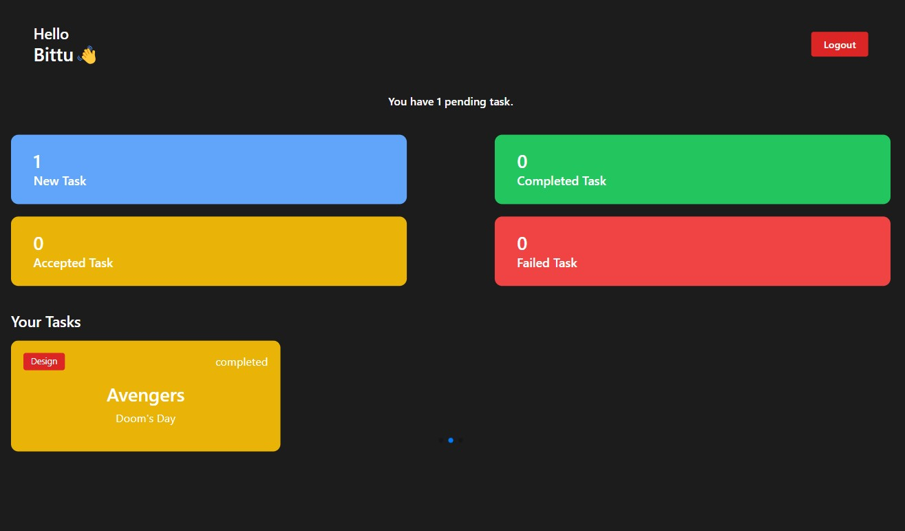

## Hello! 👋

## Table of contents

- [Hello! 👋](#hello-)
- [Table of contents](#table-of-contents)
- [Overview](#overview)
  - [Functionality](#functionality)
  - [Screenshot](#screenshot)
  - [Links](#links)
  - [Built with](#built-with)
  - [What I learned](#what-i-learned)
  - [Useful resources](#useful-resources)
- [Author](#author)

## Overview

### Functionality

Users should be able to:

- Accept, Complete and Reject the task from user dashboard

Admin should be able to:

- Assign, Manage and Track the task from admin dashboard

### Screenshot

### Links

- Live Site URL: [Employees Management System]()

### Built with

- React vite
- tailwindcss
- Javascript
- Swiper JS
- Flexbox
- Mobile-first workflow

### What I learned

I developed an Employee Management System that empowers users to accept, reject, and complete tasks assigned by an admin. The project places significant emphasis on the functionality of both the admin and user dashboards, incorporating advanced logic to enhance task management. My work highlights the use of React concepts such as useState and Context API to manage state effectively, while also ensuring a user-friendly interface with intuitive functionality. Through this project, I aim to refine my frontend development skills and explore more dynamic functionalities to deliver seamless and efficient user experiences.

### Useful resources

I have used tools like ChatGPT for code modification and testing, which will help me refine my coding practices and improve my problem-solving skills. By using AI-assisted tools, I aim to accelerate the debugging process and enhance my ability to write efficient, clean code. Additionally, I plan to regularly visit the official React documentation at react.org to stay updated with best practices, deepen my understanding of React concepts, and ensure that my knowledge remains current. This continuous learning will support my goal of developing high-quality, scalable applications.

## Author

- Github - [Github Projects](https://github.com/Akash-dev-lab)
- vercel - [Hosted Projects](https://vercel.com/akash-gods-projects)
